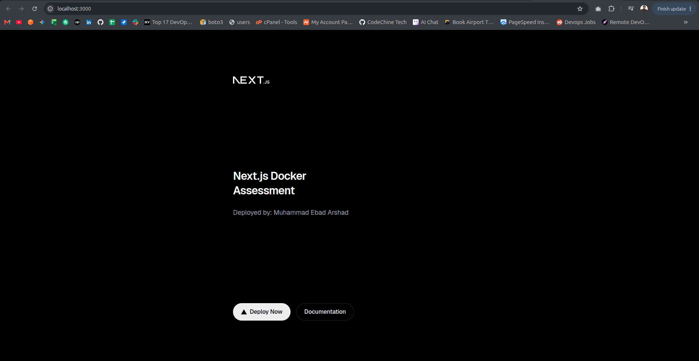
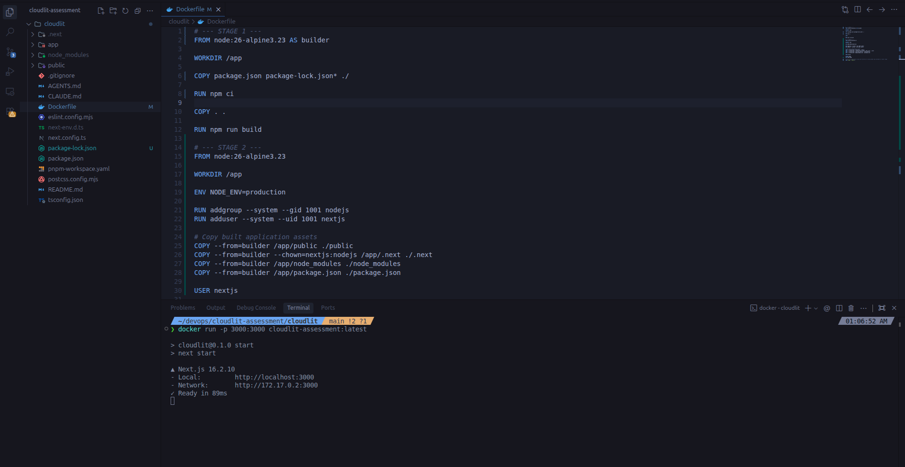
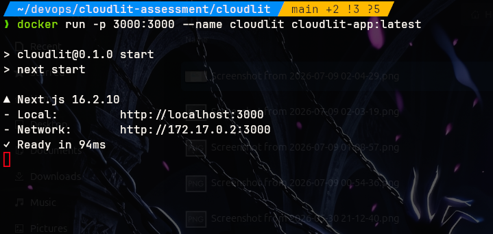
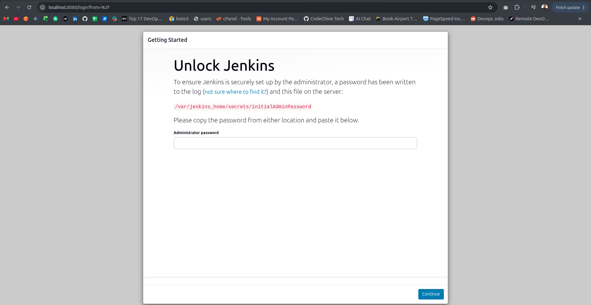
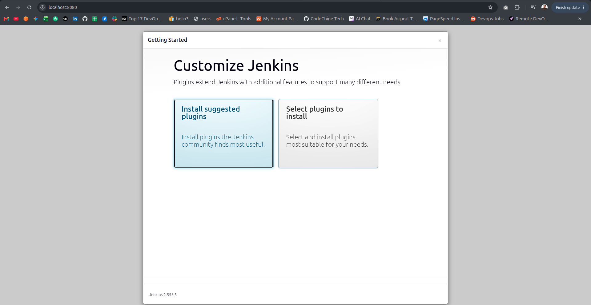

# Cloudlit DevOps Assessment

## Project Structure
Here's how the repository is laid out:

```
cloudlit-assessment/
├── cloudlit/              # Next.js app source code
│   ├── Dockerfile         # Optimized multi-stage Docker build config
├── screenshots/           # Screenshots of the working build
├── docker-compose.yaml    # Code for Jenkins docker image
└── README.md              # Documentation
```

## How to Run

### 1. Locally
If you want to run it on your machine directly without Docker:

```bash
cd cloudlit
npm install
npm run dev
```
Open [http://localhost:3000](http://localhost:3000) to see the app running.

#### Application Homepage


### 2. With Docker (Production Build)
This is containerized with a multi stage Docker build to keep things neat and lightweight:

**Build the image:**
```bash
cd cloudlit
docker build -t cloudlit-app:latest .
```

**Run the container:**
```bash
docker run -p 3000:3000 --name cloudlit cloudlit-app:latest
```
Once it's running, head over to [http://localhost:3000](http://localhost:3000) in your browser.

#### Docker Build Process


#### Running Container Status


## Dockerfile Details (Multi-stage)
* **Stage 1 (Builder):** Uses `node:26-alpine3.23` to install all dependencies (`npm ci`) and build the Next.js app (`npm run build`).
* **Stage 2 (Runner):** Also uses a lightweight Alpine image. It only copies over the compiled `.next` folder, `public` assets, and necessary `node_modules`. It sets up a non-root system user (`nextjs`) for security, exposes port 3000, and starts the server.

## Jenkins Setup

A `docker-compose.yaml` is provided to spin up a local Jenkins instance.

**Run Jenkins:**
```bash
docker compose up -d
```
Access Jenkins at [http://localhost:8080](http://localhost:8080).

#### Jenkins Dashboard & Pipeline Status


